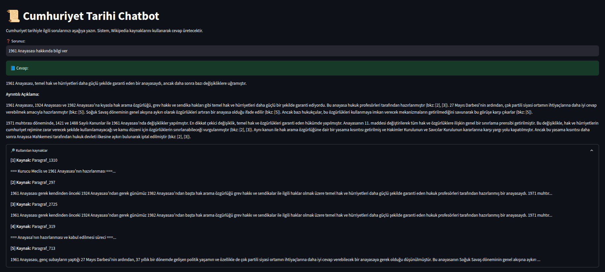

 # 🇹🇷 Cumhuriyet Tarihi Chatbotu

Bu proje, Türkiye Cumhuriyeti tarihi hakkında sorulan sorulara **Wikipedia verileri** üzerinden cevap verebilen, **RAG (Retrieval-Augmented Generation)** tabanlı bir yapay zeka sohbet botudur.

Streamlit arayüzü üzerinden çalışan sistem; Vikipedi'den alınan Cumhuriyet dönemi içeriklerini kullanarak, kullanıcıdan gelen soruları ilgili paragraflarla eşleştirip **Google Gemini LLM** üzerinden cevap üretir.

---

## Özellikler

- 🔍 Soruya uygun içerikleri FAISS ile vektör tabanlı arar
- 🤖 Gemini LLM kullanarak doğal dilde yanıtlar üretir
- 🇹🇷 Tüm içerikler ve cevaplar Türkçedir
- 📚 Wikipedia’dan otomatik veri çekme ve işleme sistemi
- 🧩 Modüler yapı: veri çekme, ön işleme, embedding, sorgulama ayrı ayrı kontrol edilebilir

---

##  Proje Yapısı
chatbot-tarih-qa/  
├── app/  
│ ├── document_loader.py  
│ ├── retriever.py  
│ ├── llm_setup.py  
│ └── streamlit_app.py  
├── build_vector_index.py  
├── scripts/  
│ ├── download_from_wikipedia.py  
│ ├── extract_paragraphs.py  
│ └── convert_txt_to_jsonl.py  
├── data/  
│ ├── raw/  
│ ├── processed/  
│ └── extracted/  
├── vectorstore/  
├── .env  
├── requirements.txt  
└── README.md  

##  Kurulum

> ⚠️ **Uyarı:** Bu proje yalnızca **Python 3.10** sürümüyle test edilmiştir.  
> Daha yeni sürümlerde (örn. Python 3.11 veya 3.12) bazı bağımlılıkların çalışmaması mümkündür.  
> Lütfen `conda` veya `pyenv` gibi bir araçla Python 3.10 ortamı oluşturunuz.

### Conda Ortamı Oluşturma (Önerilen)

```bash
conda create -n chatbot-tarih-qa python=3.10
conda activate chatbot-tarih-qa
```

### 1. Reponun Klonlanması

```bash
git clone https://github.com/ahmet-yasir/chatbot-tarih-qa.git
cd chatbot-tarih-qa
```

### 2. Gerekli Kütüphanelerin Kurulumu

> ⚠️ **Not:** FAISS kütüphanesi bu projede zorunludur.  
> `requirements.txt` dosyasına `faiss-cpu` eklenmiştir.  
> Eğer CUDA destekli bir sistem kullanıyorsanız, `faiss-cpu` yerine `faiss-gpu` kurmanız gerekebilir.

```bash
pip install -r requirements.txt
```

### 3. `.env` Dosyasını Oluşturun

Proje dizinine `.env` adında bir dosya oluşturun ve içine aşağıdaki satırı ekleyin:

```bash
GEMINI_API_KEY=your_gemini_api_key_here
```

> 🔑 **Not:** Google Gemini API anahtarınızı [Google AI Studio](https://makersuite.google.com/app) üzerinden ücretsiz olarak alabilirsiniz.

##  Veri Seti Hazırlama

Veri seti iki farklı yöntemle elde edilebilir:

---

### Yöntem 1: Otomatik Wikipedia'dan Veri Çekme (Script ile)

Bu yöntemde proje içinde bulunan `scripts/` dizisindeki hazır Python betikleri ile Wikipedia’dan doğrudan veriler çekilir ve işlenir.

#### 1. Wikipedia İçeriğini İndir

```bash
python scripts/download_from_wikipedia.py
```
Bu script seçilen Cumhuriyet tarihi başlıkları data/raw/ klasörüne .txt dosyaları olarak kaydeder.

#### 2. Paragrafları Ayıkla

```bash
python scripts/extract_paragraphs.py
```
Bu script paragrafları çıkarır ve data/processed/rag_paragraflar.txt dosyasına yazar.

#### 3. JSONL Formatına Dönüştür

```bash
python scripts/convert_txt_to_jsonl.py
```
Bu script ile data/extracted/ klasörüne her paragraf ayrı bir .jsonl satırı olarak kaydedilir.

### Yöntem 2: Hazır Veri Seti (Kaggle veya Drive)
Zaman kazanmak için önceden hazırlanmış .jsonl formatındaki Cumhuriyet tarihi veri setini doğrudan indirebilirsiniz.

### Hazır JSONL Veri Seti - Kaggle
Zaman kazanmak için önceden hazırlanmış .jsonl formatındaki Cumhuriyet tarihi veri setini doğrudan indirebilirsiniz.

<a href="https://www.kaggle.com/datasets/ayasir/cumhuriyet-tarihi-belgeleri" target="_blank">Hazır JSONL veri seti - Kaggle</a>

İndirdikten sonra data/extracted/ klasörüne yerleştirmeniz yeterlidir:

## Vektör Veritabanı Oluşturma

Veriler `.jsonl` formatında hazırlandıktan sonra, embedding (vektörleştirme) işlemi gerçekleştirilir. Bu işlem sonucunda FAISS formatında bir vektör veritabanı oluşturulur.

Aşağıdaki komutu kullanarak veritabanını oluşturabilirsiniz:

```bash
python build_vector_index.py
```
Bu komut şunları yapar:
- data/extracted/ klasöründen belgeleri yükler.
- sentence-transformers/paraphrase-multilingual-MiniLM-L12-v2 modeli ile her belgeyi  vektörleştirir.
- Vektörleri FAISS kullanarak vectorstore/faiss_index/ klasörüne kaydeder.

##  Uygulamanın Başlatılması

Tüm kurulumlar tamamlandıktan ve vektör veritabanı oluşturulduktan sonra, Streamlit arayüzünü başlatmak için aşağıdaki komutu çalıştırın:

```bash
streamlit run app/streamlit_app.py
```
Komut çalıştırıldıktan sonra tarayıcınızda otomatik olarak bir arayüz açılır. Bu arayüz üzerinden sorularınızı sorabilirsiniz.

## 🧪 Örnek Kullanım

Aşağıda uygulamanın çalışma örneğini görebilirsiniz:

### 🖼️ Ekran Görüntüsü



> Görselde, kullanıcı tarafından yazılan soruya sistemin Wikipedia kaynaklarıyla nasıl yanıt verdiği gösterilmektedir.
